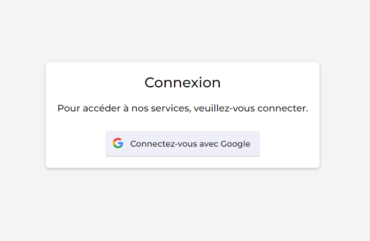

# Google Connection PHP


<div align="center">
  
</div>

## Description

This project contains configuration files for connecting to Google via PHP. It is designed to facilitate the integration of Google authentication into your PHP applications.

## Prerequisites

- PHP 7.x or higher
- Composer
- A Google Developer account to obtain API keys

## Installation

1. Clone this repository into your local workspace:

    ```bash
    git clone https://github.com/Gael-Pitras/google-connexion-php.git
    ```

2. Install dependencies via Composer:

    ```bash
    cd google-connexion-php
    composer install
    composer require google/apiclient "^2.0"
    ```

3. Add your Google API keys in `config.php`:

    ```env
    $google_app_id = 'YOUR_CLIENT_ID';
    $google_app_secret = 'YOUR_SECRET_CODE';
    ```


